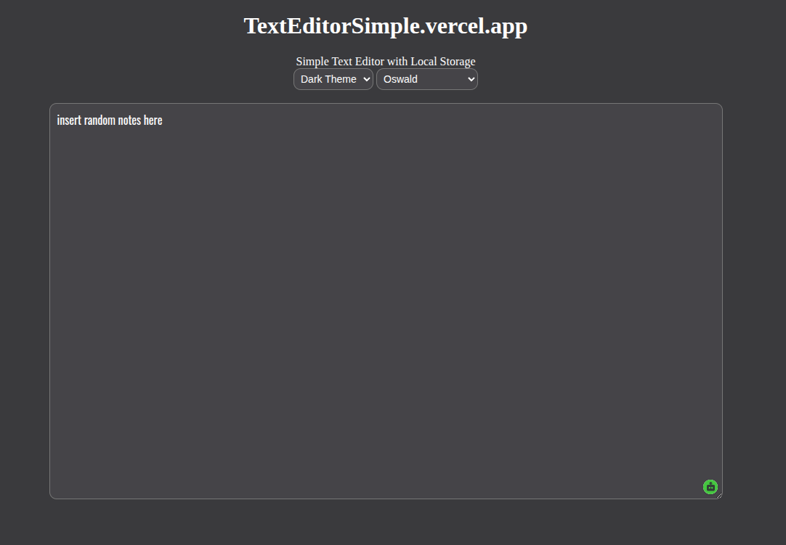
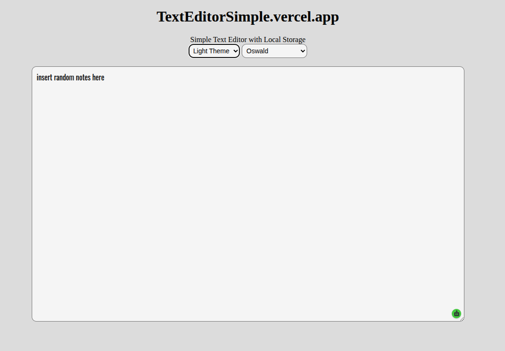
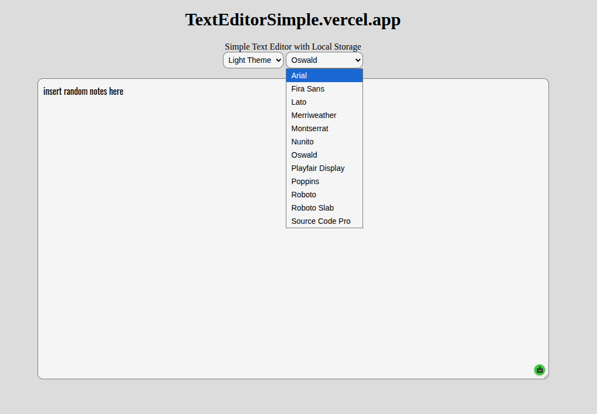

# Simple Text Editor

## Overview
There are many text editors online, most of which are bloated with features that aren’t necessary.

This project is my attempt at a lightweight alternative:  
 https://texteditorsimple.vercel.app

It includes essential features like dark mode, font selection, and localStorage saving — without unnecessary complexity.

## Features
- Dark Theme
- Light Theme
- Font selection (10 fonts)
- LocalStorage saving (no cloud dependency)
- Minimal centered layout

## Fonts Included
- Arial
- Fira Sans
- Lato
- Merriweather
- Montserrat
- Nunito
- Oswald
- Playfair Display
- Poppins
- Roboto
- Roboto Slab
- Source Code Pro

## Gallery

  
  
  

